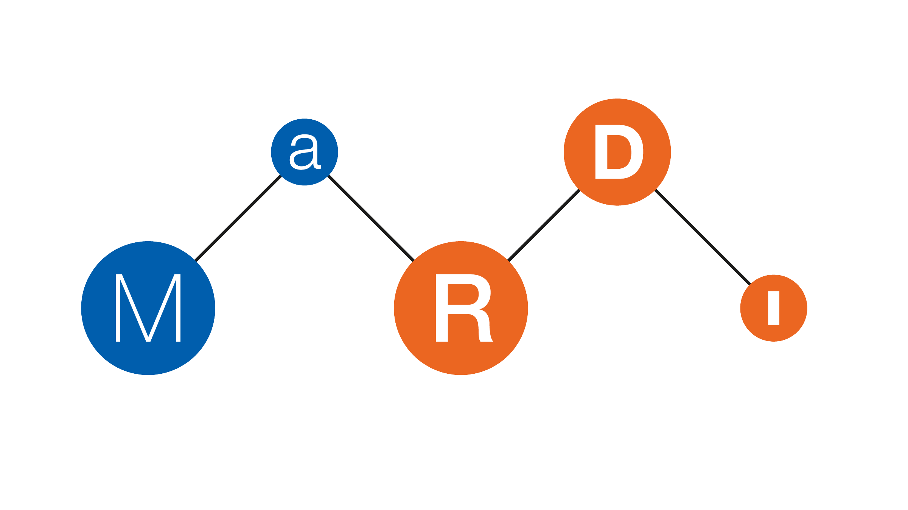

# Building a Knowledge Graph for Scientific Computing

<small>René Fritze (rene.fritze@wwu.de)</small>

<small>Applied Mathematics Münster</small>

<small>GAMM Annual Meeting 2022</small>

<small>August 16th, 2022</small>

---

<div class="container">

<div>

## Get the slides

[https://rene.fritze.me/22-gamm](https://rene.fritze.me/22-gamm)

</div>

<div>

</div>
</div>

---

<div class="container">

<div>

## 1st MaRDI Workshop on Scientific Computing

### 26.10. - 28.10.22 in Münster, Germany

[https://workshop.mardi.ovh/](https://workshop.mardi.ovh/)

</div>

<div>

</div>
</div>
---

<div class="container">

<div>

## MaRDI and Me

- Started November 2021

- 1 of 30 NFDI consortia

- 15 Institutions plus partners

- THE math consortium

[mardi4nfdi.de](https://mardi4nfdi.de/)

</div>

<div>

</div>
</div>

---

<div class="container">

<div>

## MaRDI and Me

- I joined TA2 on January 1st

- We have 1.8 positions in Münster, working on knowledge graph
and open software interfaces

- Partners in Madgeburg complete TA2 with
benchmark framework and workflow standardization

</div>

<div>


</div>
</div>

---

# Motivation

Why do want to build a knowledge graph for scientific computing?

---


## Meet Bob

- Bob is a *computational biologist*
- His new work involves solving a non-smooth optimization problem.

<div class="footnote">

[Portrait illustration vector created by freepik - www.freepik.com](https://www.freepik.com/vectors/portrait-illustration)

</div>

---


- He has no expericence with this.
- He wants to find the best algorithm for his specific problem and a software library he can use.
- He does not really know how to get an overview of what his options are.

<div class="footnote">

[Portrait illustration vector created by freepik - www.freepik.com](https://www.freepik.com/vectors/portrait-illustration)

</div>
---


- A google scholar search is daunting.
- Luckily, he has a colleague, who has had a similar problem before, he can ask for advice.

<div class="footnote">

[Portrait illustration vector created by freepik - www.freepik.com](https://www.freepik.com/vectors/portrait-illustration)

</div>

---


## Meet Alice

- Alice is an expert in model reduction.
- She wants to follow current research in her field and compare her algorithms to the state of the art of competing methods.

<div class="footnote">

[Portrait illustration vector created by freepik - www.freepik.com](https://www.freepik.com/vectors/portrait-illustration)

</div>
---


- She's clearly too busy to follow [math.NA](https://arxiv.org/list/math.NA/recent), and not everything is there.
- There is no useable AMS classification. Keywords? But which?

<div class="footnote">

[Portrait illustration vector created by freepik - www.freepik.com](https://www.freepik.com/vectors/portrait-illustration)

</div>
---


## Meet Alice

- Luckily, she can follow all relevant researchers on ResearchGate and meet them at conferences.
- Implementing a competitor's method and comparing it to her own is too much work, so she does not do it.

<div class="footnote">

[Portrait illustration vector created by freepik - www.freepik.com](https://www.freepik.com/vectors/portrait-illustration)

</div>
---

## The underlying problems

No way to directly search/get suggestions for:

- journal articles discussing a specific algorithm
- (benchmark) experiments comparing algorithms for a specific problem
- implementing software

---

## The underlying problems

No way to directly search/get suggestions for:

- algorithms that solve a certain mathematical problem
- algorithms similar to a given algorithm

---

## Our goal

Build and maintain a knowledge graph of numerical algorithms
    which interlinks those algorithms with the addressed mathematical problems and associated research
    data such as journal papers, benchmarks or implementing software packages.

---

## What is a Knowledge Graph

- A way to formaly encode relationships between objects
- A set of "subject-predicate-object" statements (triples)

---

## Examples

[Wikidata](https://www.wikidata.org/wiki/Q108327788)

```bm:HPCG a :benchmark .```

⇕
<small>
```https://mardi4nfdi.de/algodata/0.1/benchmark#HPCG a https://mardi4nfdi.de/algodata/0.1#benchmark .```

</small>

---

## Where we are

1. First version of an ontology for algorithms
2. Started graphs for numerical linear algebra and model order reduction
3. [Prototype query frontend](https://esco-demo.m1.mardi.ovh) (still internal)

---

### Some implementation notes

- Django Web Frontend and REST API
- Triple Store using Apache Fuseki
- Automated tests using Microsoft Playwright

---

### The future

## 1. Feedback rounds on the interface/API

---

### The future

## 2. First public release of the platform

- repository open to the public
- query frontend accessible for everyone

---

### The future

## 3. Integration with the MaRDI Portal

<https://portal.mardi4nfdi.de/wiki/Portal>

---

### The future

## 4. Editorial features

- propose changes through the interface
- establish curation process

Only community driven expansion can make the platform useful!

---

<div class="container">

<div>

## Get the slides

[https://rene.fritze.me/22-gamm](https://rene.fritze.me/22-gamm)

</div>

<div>

</div>
</div>

---

<div class="container">

<div>

## 1st MaRDI Workshop on Scientific Computing

### 26.10. - 28.10.22 in Münster, Germany

[https://workshop.mardi.ovh/](https://workshop.mardi.ovh/)

</div>

<div>

</div>
</div>
