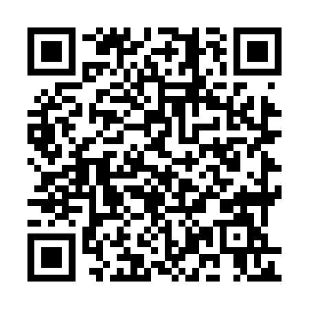

# Building

<small>René Fritze</small>

<small>rene.fritze@wwu.de</small>

<small>Applied Mathematics Münster</small>

<small>August 16, 2022</small>

<small>*GAMM*</small>

---

# Outline

1. Introduction
2. Results
3. References

---

# Introduction

---

## Results

---

## References

---

## Get the slides

[https://rene.fritze.me/cookiecutter-reveal-md/](https://rene.fritze.me/cookiecutter-reveal-md/)

---

## Mermaid diagrams

[More info](https://mermaid-js.github.io/mermaid/)

